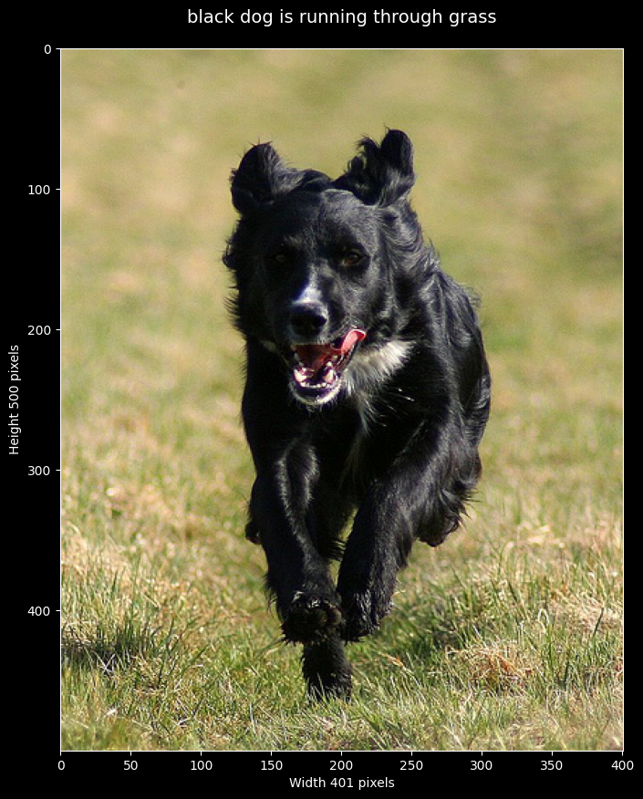
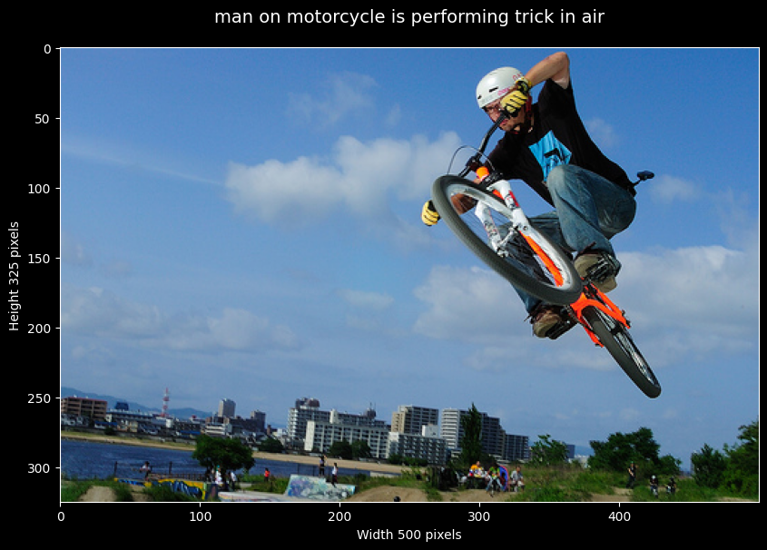
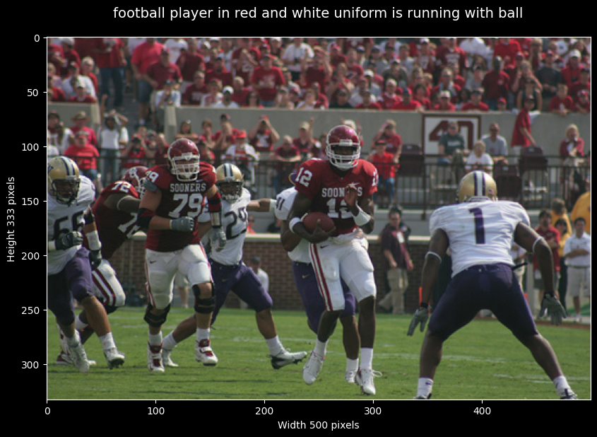

# Visual Storyteller

A deep learning image captioning model trained on the Flickr8k dataset.

This project allows you to generate descriptive captions for images and visualize the results.

---

## Notebooks

- **`data_and_training.ipynb`**  
  Guides you through data preparation, training/validation setup and model training.

- **`inference.ipynb`**  
  Demonstrates how to generate captions for images and visualize the outputs.

---

## Example Outputs

Generated captions for sample images:

